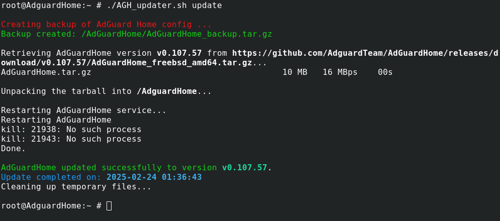
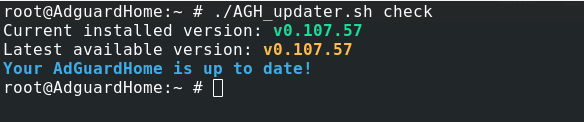

# AGH_Updater
AGH_Updater.sh is a shell script for updating the AdGuard Home inside the FreeNAS/TrueNAS jail.

This script will use search for update and if there is a newer version than the currently installed version, the script will download latest release and install the new version.



## Installation

Download the AGH_Updater.sh script in your jail:

```bash
  fetch https://raw.githubusercontent.com/mstinaff/PMS_Updater/master/PMS_Updater.sh
```

Create folder "Updater" with writable permission:
```bash
  cd ..
  mkdir Updater
  chmod a+w Updater
```

## Usage

Run the script as root. The following options can be used:
```bash
   check    Script will only check if there is an update
   update   Script will go ahead and update AdGuard Home, even if the version is the same as the latest release
   
   example:
          ./AGH_updater.sh check
          ./AGH_updater.sh update

```




When there is no option used, script will go inform to use one of the two options and will stop.

The script can also be called from a cronjob to check for updates on a regular schedule.


## Troubleshooting

I did test the script on my TrueNAS 13-U7 and Nextcloud 30.0.6.

If you happen to find any errors, please open issu ticket

I did install additional packages to my iocage:

```bash
pkg install jg curl
```

## Sidenotes

Thanks to the [FreeNAS](https://www.truenas.com/community)/[TrueNAS](https://www.truenas.com/community) forums for all the help provided.

[AdGuard Home](https://github.com/AdguardTeam/AdGuardHome) is an amazing, free and open source, powerful network-wide ads & trackers blocking DNS server. 

To address this I have made a script that can be copied into a running AdGuard Home jail, and without needing anything else, it can search and check for newer versions. If a newer version is found it can automatically installed to the server.
